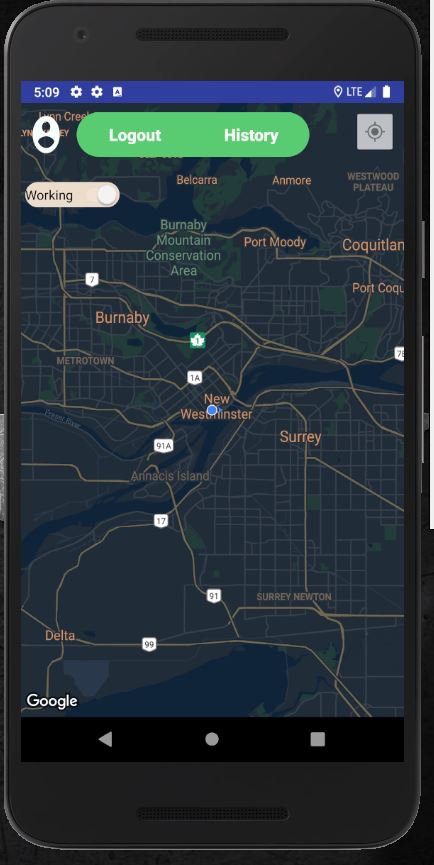

# MobileApp-RideSharing-App-
Take Me Home is a ridesharing app for fast, reliable travel at any time during the day or night. There’s no need to park or wait for a taxi or bus. With Take Me Home, you just tap to request a ride, and it’s easy to pay with credit card.

Take Me Home – here’s how it works:
- Login or Signup.

  

- Opening the app and tell where you want to go.

- The app uses your location, so your driver knows where to pick you up.
- You’ll see your driver’s picture and vehicle details and can track their arrival on the map.

- Vehicle Selection

- Coupons
- Payment can be made by credit card, cash (in selected cities only)
- After the ride, you can rate your driver and provide feedback for the Take Me Home experience.
- Drivers will be given independent contracts.
- Fare Calculator
- Trip History

